#Jenkins

##1. Jenkins是什么
Jenkins 是一个提供了持续集成功能的开源项目

##2. 安装jenkins(war包方式)
###1. 前往https://jenkins-ci.org/下载war包
###2. 安装java运行环境(http://www.2daygeek.com/openjdk-8-installation-centos-fedora/)并设置JAVA_HOME环境变量
1. Check current version of java
```
	java -version
```
2. Search OpenJDK 8 Packages
```
yum search java | grep openjdk
```
3. Install OpenJDK 8 packages
```
yum install java-1.8.0-openjdk.x86_64
yum install java-1.8.0-openjdk-devel.x86_64

```
4. Check current version of java
```
java -version
javac -version
```
###3. 安装tomcat(https://www.digitalocean.com/community/tutorials/how-to-install-apache-tomcat-7-on-centos-7-via-yum)
###4. 部署jenkins.war到tomcat 
###5. http://ip_address:8080/jenkins 查看jenkins dashboard， 如下图

 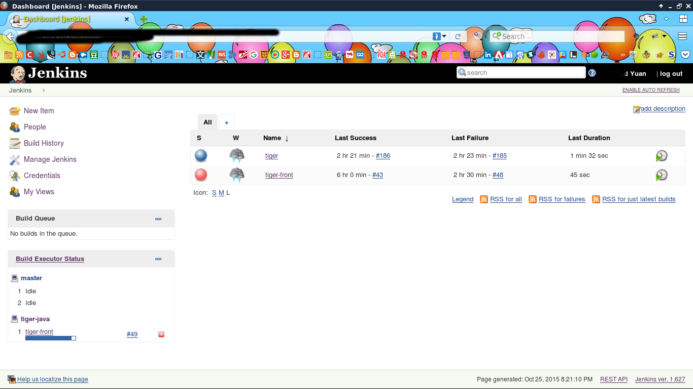 
 
##3. 插件安装
###1. 进入jenkins插件中心
在jenkins dashboard > Manage Jenkins > Manage Plugins
然后在Available中进行搜索
###2. 插件列表
1. github
2. gradle
3. deploy to container plugin

搜索以上插件，并安装，勾选Restart Jenkins when installation is complete and no jobs are running

 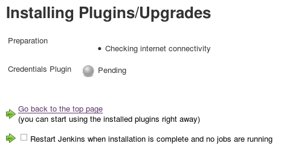 

等待重启

### jenkins配置
在jenkins dashboard > Manage Jenkins > Configure System中进行配置
需要配置：
1. JDK
2. Git
3. Gradle
请根据系统配置进行相应的配置

##3. 配置持续集成项目
###1. tiger
####1. jenkins dashboard > New Item
1. 输入名称
2. 选择类型，推荐Freestyle project

 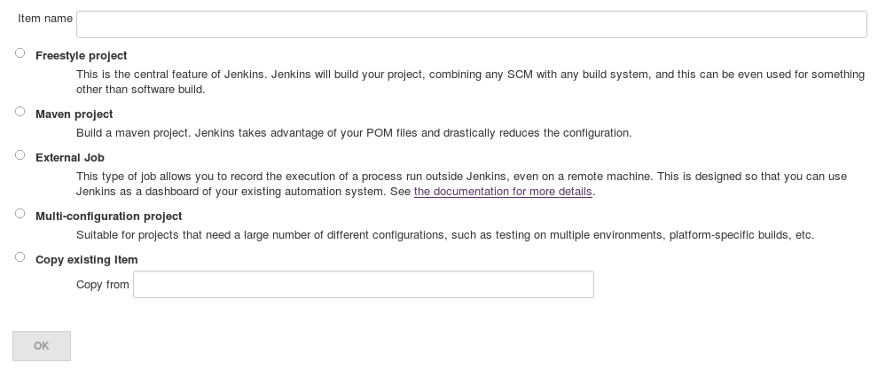 

####2. jenkins dashboard > New Item
#####1. 配置Github project地址
在以下界面中输入project在github中url，你的githubCredentials，并配置你要自动部署的项目分支
效果如下图

 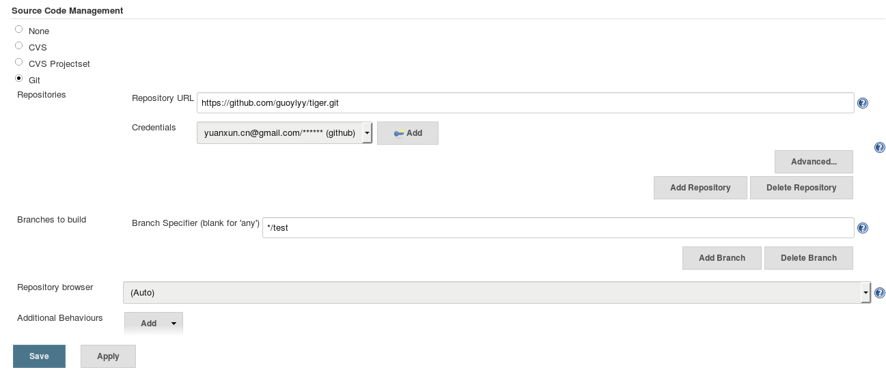 

#####2. 配置自动部署时间
1. 勾选Build when a change is pushed to GitHub 和 Poll SCM
2. 并在Poll SCM的Schedule中输入
```
H/5 * * * *
```
上面输入的意思是每5分钟查看github是否有更新
注：本来是可以让github的插件实现自动拉取出项目更新的，但是测试时发现并没有卵用
效果如下图

 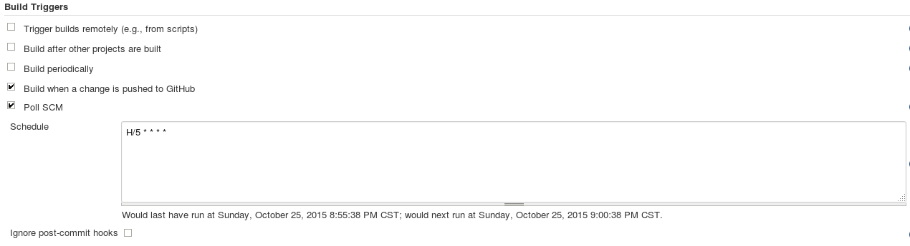 

#####3. 配置部署步骤
tiger项目需要
######1. 在tiger-common-dal下执行flywayMigrate实现数据库的自动集成
效果如下图

 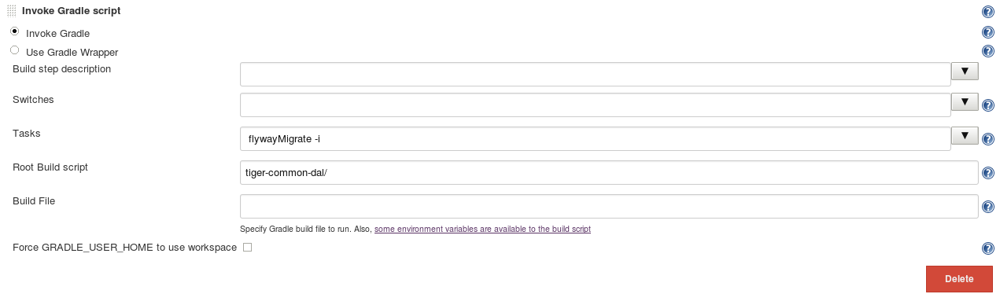 
 
######2. 在tiger-web-api下执行build进行web api项目的创建
效果如下图

 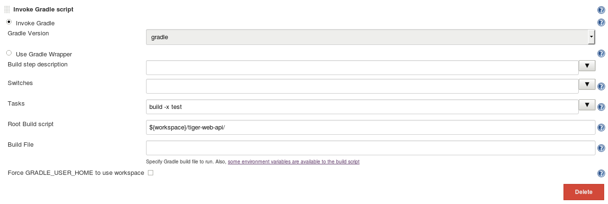 
 
######3. 一大波shell命令来让项目跑起来
```
cp tiger-web-api/doc/web-api.html index.html
mv index.html /usr/share/nginx/html/api/v1/index.html
PID=$(lsof -i:8080 | tail -1 | awk '{print$2}')
if [ -n ${PID+x} ] ; then 
    kill -9 $PID;
fi
BUILD_ID=dontKillMe java -Xdebug -Xrunjdwp:server=y,transport=dt_socket,address=8000,suspend=n -jar tiger-web-api/build/libs/tiger-web-api.jar &
```
效果如下图

 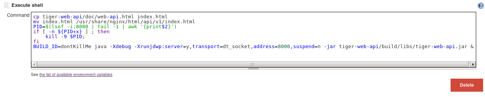 

######4. save & test & debug

###2. tiger-front
以上为手动配置的例子，下面举一个使用jenkins restful API的栗子
####1. post to ip_address/jenkins/createItem
1. 设置parameter name=JOBNAME
2. 添加xml配置文件，该文件可以从已经配置好的jenkins项目中导出
3. 效果如下图：

 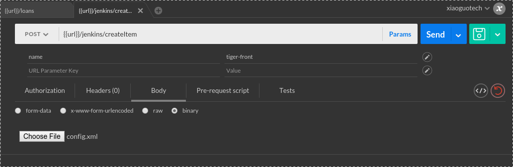 

4. 好的，创建好了，如果有要修改的细节，请查考上面的栗子

##4. 安全配置
###1. 注册用户
现在采用jenkins
1. 进入jenkins dashboard > Manage Jenkins > Configure Global Security
2. 勾选Security Realm下的Jenkins’ own user database 以及Allow users to sign up
3. 勾选Authorization下的Logged-in users can do anything 

 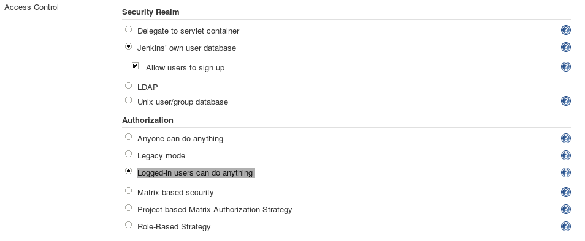 

4. 保存生效后注册用户，入口在页面右上角

 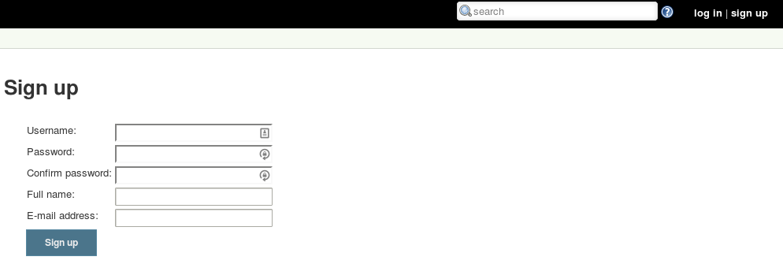 

5. 关闭用户注册，并采用Matrix-based security，添加用户，赋予权限（最右边有一次勾选所有的快捷按钮）

 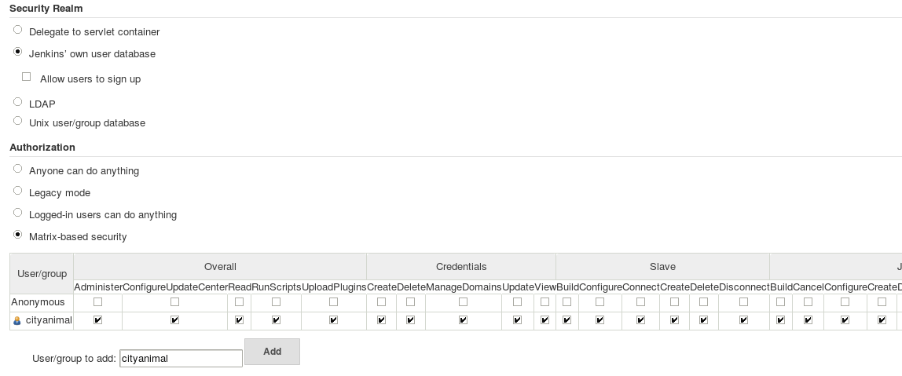 

6. 完成

