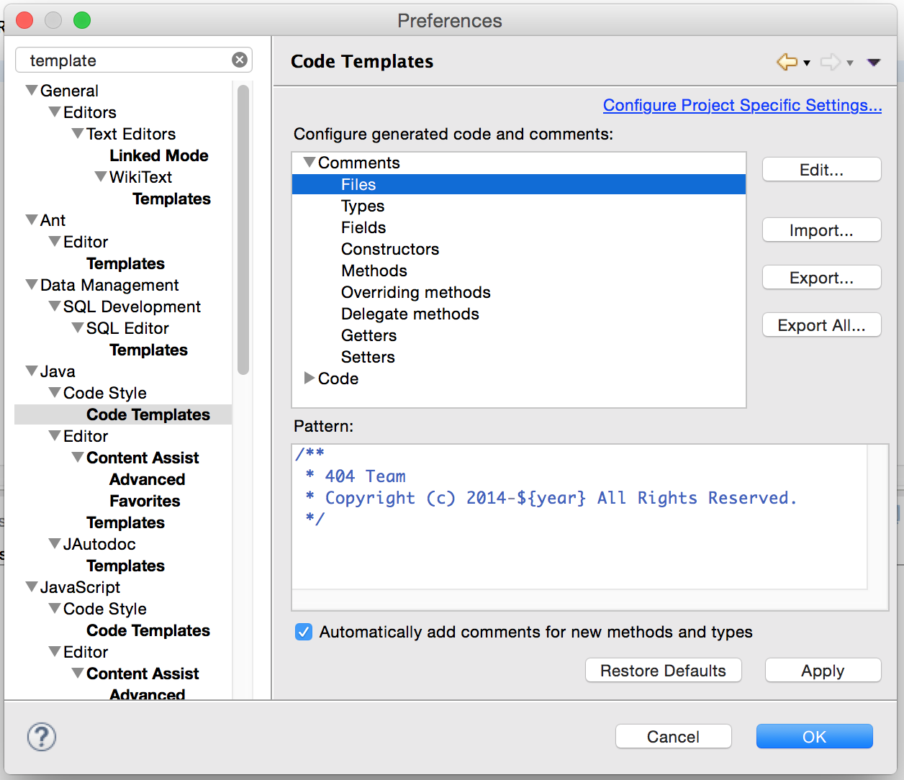
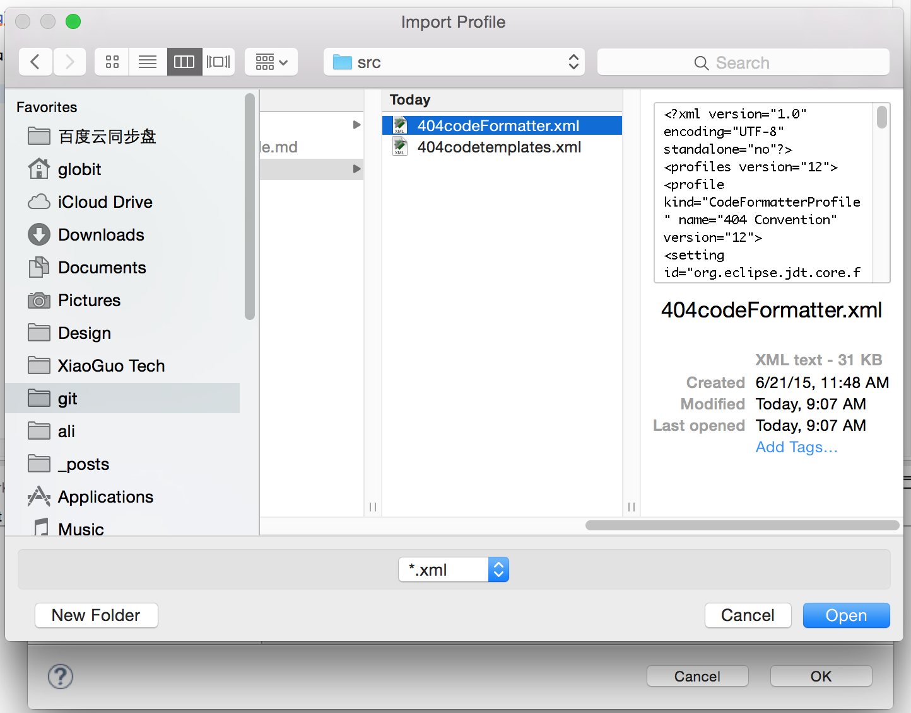
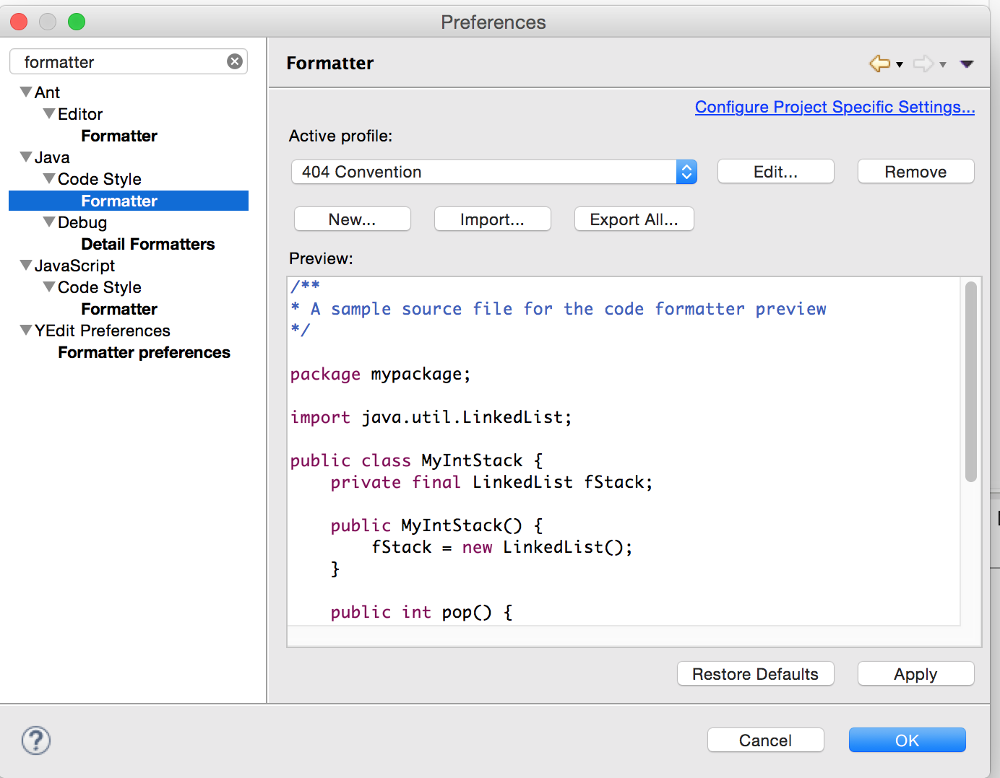

# Java编程风格指南

## 为什么统一风格

* 不吭自己
* 不吭队友

## 工具

1. template 文件
	
	eclipse用于规定生成代码样式的文件
2. formatter 文件
	
	eclipse用于规定format 过后的代码风格的文件
3. JautoDoc插件

	一键插入所有注释插件
4. checksyle 插件

	build 时验证代码风格插件（也有eclipse插件版本）
	
## 注释介绍

* 注释一定要写
* 如果容易理解的就用 AutoDoc 生成
* 写注释的时候要有同理心

### Java 文件头部

### 类头部
有 Team 标识:

### 方法头部

### 关键变量

### 如何生成标准注释？

1. 导入 template 文件

2. 导入 formatter 文件

## AutoDoc

### 安装

### 快捷键

### 修改生成的注释

## checkStyle

* 每次提交代码的时候要build，查看是否有未处理的 checkStyle 问题
* 每周会集中处理

	
	