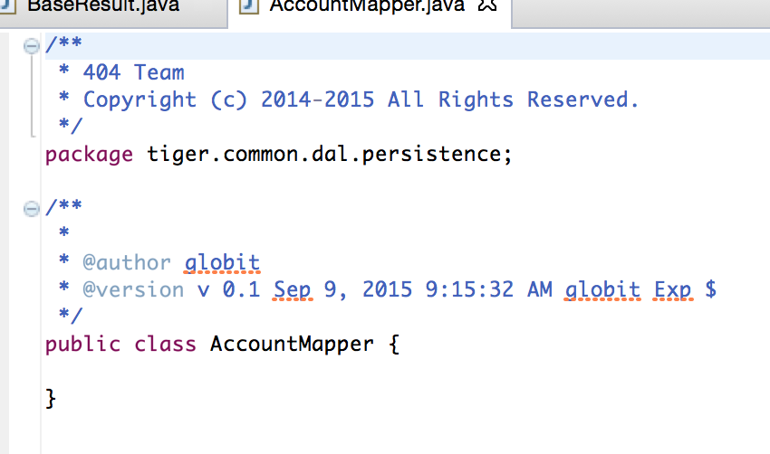
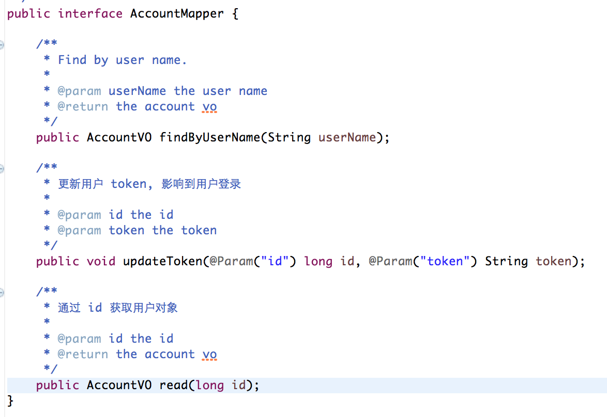
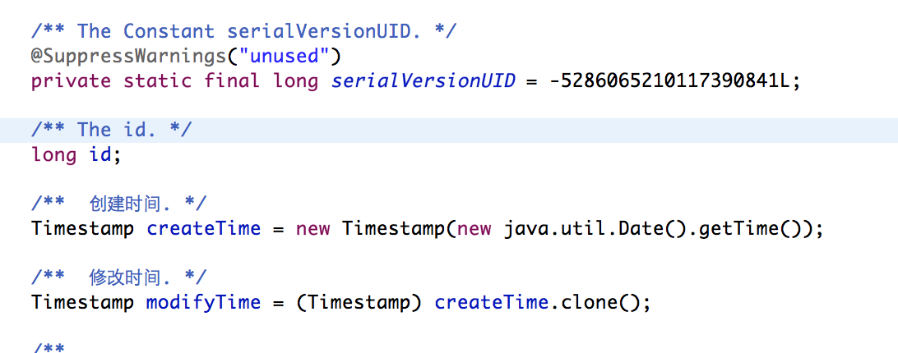
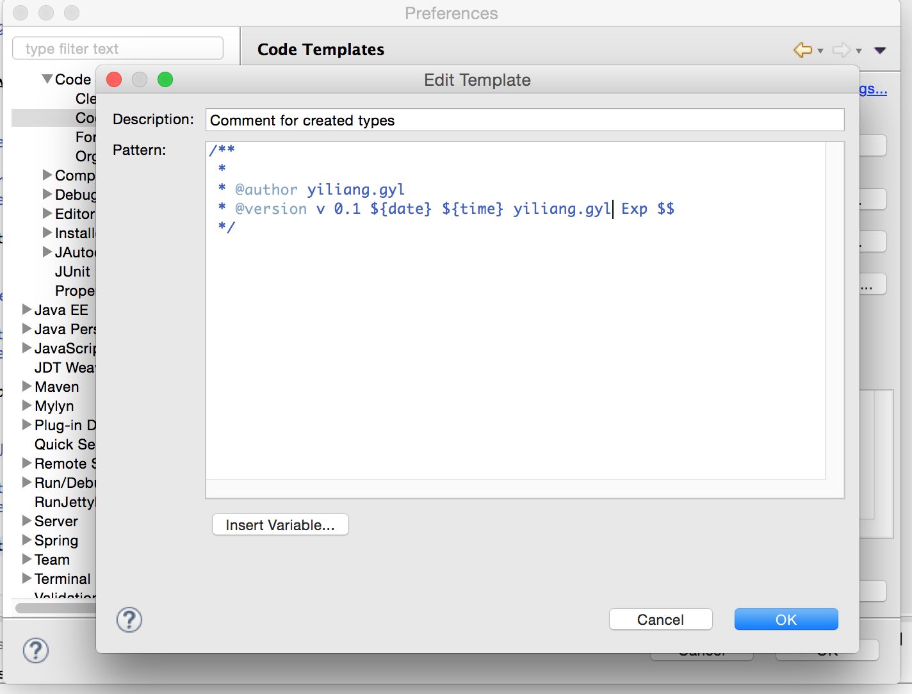
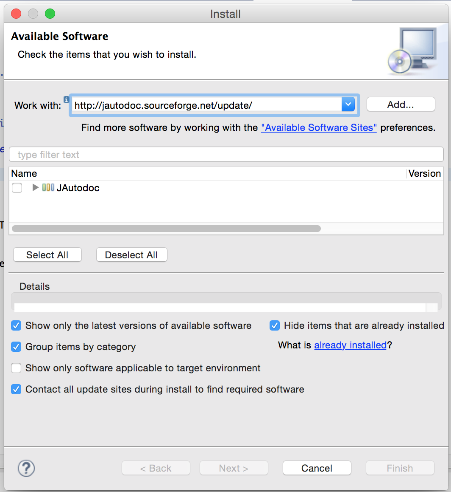

# Java编程风格指南

## 为什么统一风格

* 不吭自己
* 不吭队友

## 工具

1. **template 文件**
	
	eclipse用于规定生成代码样式的文件
2. **formatter 文件**
	
	eclipse用于规定format 过后的代码风格的文件
3. **JautoDoc插件**

	一键插入所有注释插件
4. **checksyle 插件**

	build 时验证代码风格插件（也有eclipse插件版本）
	
## 注释介绍

* 注释一定要写
* 如果容易理解的就用 AutoDoc 生成
* 写注释的时候要有同理心

### Java 文件头部
有 Team 标识 和 头部有更新人等标识:

### 方法头部
方法要让人可以明白:

### 关键变量
关键变量说明什么意思:

### 业务逻辑

### 私有方法

### 如何生成标准注释？

#### 导入 template 文件

[下载地址](src/404codeTemplates.xml)

设置自己的名字:

### 导入 formatter 文件

[下载地址](src/404codeFormatter.xml)

## AutoDoc

### 安装

**Url地址:** http://jautodoc.sourceforge.net/update/

**安装方法:** 进入 eclipse Help/Install New Software, 复制以上地址，一路下一步安装

### 快捷键

Mac: alt + control + J (把光标移动到类名上面按下，会有惊喜额）

### 修改生成的注释

原则:

* 一些显而易见的方法如 getter setter 可以直接用生成英文注释
* 一些关键方法必须用中文注释
* 关键变量必须用中文注释

## checkStyle

* 每次提交代码的时候要build，查看是否有未处理的 checkStyle 问题
* 每周会集中处理

	
	